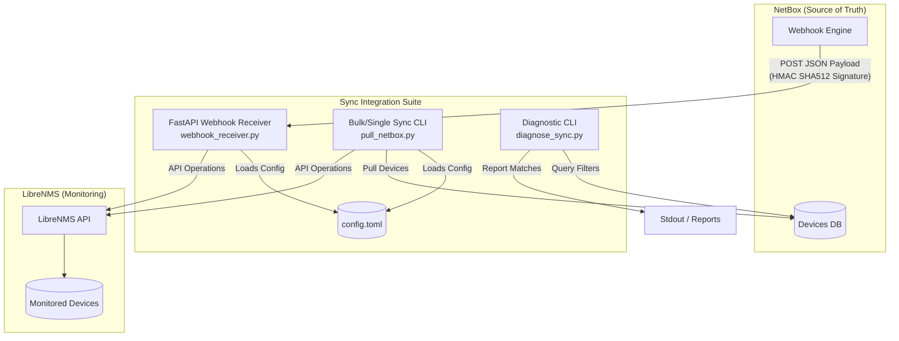

# NetBox to LibreNMS Integration Suite

Welcome to the **NetBox to LibreNMS Integration Suite**. This repository contains a collection of production-grade tools designed to synchronize devices between **NetBox** (acting as your Network Source of Truth) and **LibreNMS** (your automated monitoring platform). 

The integration maintains a strict mapping between NetBox device models and LibreNMS monitored hosts, ensuring real-time or scheduled synchronization of device hostnames, display names, locations, and SNMP credentials.

---

## 🏗️ Architecture & Flow Overview

The suite supports both **real-time event-driven sync** (via webhooks) and **scheduled bulk syncs/diagnostics** (via CLI scripts). All components rely on a shared configuration file (`config.toml`) and reuse the core `LibreNMSClient` logic for consistent execution.



---

## ⚡ 1. Real-Time Webhook Receiver (`webhook_receiver.py`)

The **Webhook Receiver** is a lightweight, high-performance web service built with **FastAPI** and **Uvicorn**. It exposes a secure endpoint that NetBox triggers instantly whenever device information changes.

### How it Works
1. **Signature Verification (Security first):** If a `secret_key` is configured, the receiver validates the payload's integrity using HMAC-SHA512. It computes the hash of the request body and compares it with the `X-Hook-Signature` header sent by NetBox, preventing spoofing attempts.
2. **Event Parsing:** It filters out non-device models (supports both older `device` and newer `dcim.device` namespaces) and extracts the device ID, name, status, and IP addresses.
3. **Filter Checks:** It checks the incoming payload against the sync filters defined in `config.toml` (e.g. status, roles, platforms, device types, or tenants).
4. **Synchronization Logic:**
   - **`created` / `updated` Events (Matching Filters):** 
     - If the device is found in LibreNMS, it verifies the **link component** (which associates the NetBox device ID to the LibreNMS device ID).
     - If it is already linked, it synchronizes any modified fields (renames hostnames, updates display names, or moves locations).
     - If the device exists in LibreNMS but has no link, it links them.
     - If the device does not exist, it automatically enrolls it in LibreNMS.
   - **`deleted` Events / Status Changes (No longer matching filters):**
     - If a device is deleted in NetBox, or if its status changes to something excluded (like `offline` or `decommissioned`), the receiver automatically **unlinks** the device in LibreNMS. This protects historical monitoring data while keeping the active inventory clean.
5. **Health Endpoint:** Exposes a GET `/health` endpoint which reports the service state and whether it is in dry-run mode.

---

## 🛠️ 2. Bulk/Single Manual Sync (`pull_netbox.py`)

The `pull_netbox.py` script is a powerful command-line utility used to perform full-inventory audits, initial imports, or manual targeted updates.

### How it Works
1. **Interactive Credential Retrieval:** If API tokens are not defined in the environment or config file, the script securely prompts the user using masked inputs (`getpass`), preventing credentials from appearing in command-line histories.
2. **Metadata Fetching:** It queries NetBox to resolve active device roles, fuzzy roles, and filter scopes.
3. **Targeted Filtering:** It pulls devices that match configured tenant, role, and platform filters, immediately discarding devices that lack a primary IPv4 or Out-of-Band (OOB) IP address.
4. **LibreNMS Inventory Mapping:** It loads all monitored devices from LibreNMS and maps them to their corresponding NetBox ID via the unique "NetBox ID" component.
5. **Reconciliation & Enrolment:**
   - **Fields Audit:** For all already-linked devices, it verifies that the hostname, display name, and site location match NetBox, executing API updates if they are out of sync.
   - **Auto-Discovery Matching:** For devices that aren't linked, it checks LibreNMS for matching IPs or hostnames. If a match is found, it links them; otherwise, it initiates a new enrolment.
   - **Multi-Credential SNMP Probing:** When adding a device, it attempts to enroll it using the configured credentials. It tries **SNMPv3** credentials first (or multiple v3 profiles if defined), falling back to **SNMPv2c** community strings if v3 probes fail (configurable).
   - **Rate Limiting:** Employs a `1.0s` sleep delay between new enrolments to prevent overwhelming the LibreNMS API or network switches.
6. **Orphan Analysis:** In bulk mode, any unlinked LibreNMS devices are evaluated as potential "orphans." The script queries NetBox by IP and display name, warning you if an active device exists in NetBox but was bypassed due to configured filters.

### CLI Usage Examples
```bash
# Perform a full bulk synchronization of all matching devices
python pull_netbox.py

# Run in dry-run mode (defined in config.toml general block) to see proposed changes without applying them
# Sync a SINGLE target device by its NetBox Name or numerical ID (bypasses standard tenant/role filters)
python pull_netbox.py --device "test-router-01"
python pull_netbox.py --device 1234
```

---

## ⚙️ 3. Configuration System (`config.toml`)

Both scripts share a single `config.toml` structure. Customize it by copying the template:
```bash
cp config.toml.example config.toml
```

### Configuration Sections Breakdown

| Section | Parameter | Type | Description |
| :--- | :--- | :--- | :--- |
| **`[librenms]`** | `api` | String | Base URL of your LibreNMS API devices directory (e.g. `https://your-librenms/api/v0/devices/`). |
| | `token` | String | LibreNMS API token with write permissions. Leave empty `""` to use Env variables or secure runtime prompts. |
| | `ca_verify` | Bool/Str | `true` to verify SSL, `false` to ignore (useful for self-signed certificates), or a path to a custom CA bundle. |
| **`[netbox]`** | `api` | String | Base URL of your NetBox instance. |
| | `token` | String | NetBox API Token (read-only is sufficient). Leave empty to use Env variables. |
| | `ca_verify` | Bool/Str | SSL certificate verification setting for NetBox connection. |
| | `tenants` | Array | Slugs or numerical IDs of NetBox Tenants to pull (e.g. `["tenant-slug", 42]`). Leave empty `[]` to pull all. |
| | `roles` | Array | Strict NetBox device role slugs to synchronize. |
| | `fuzzy_roles` | Array | Substrings to match role slugs dynamically (e.g. `["switch"]` matches both `core-switch` and `edge-switch`). |
| | `device_types` | Array | Slugs of hardware models to filter by. |
| | `platforms` | Array | Slugs of OS/Platforms to filter by (e.g. `["ios-xe", "nx-os", "aci"]`). |
| | `statuses` | Array | Device statuses allowed to sync (e.g. `["active", "staged"]`). |
| | `override_pull_ids` | Array | Specific NetBox device IDs to always include, bypassing tenant/role rules. |
| **`[snmp]`** | `prefer_v3` | Bool | If `true`, tries SNMPv3 enrollment first, falling back to SNMPv2c. If `false`, tries SNMPv2c first. |
| **`[snmp.v2c]`** | `community` | String | SNMPv2c read community string used for device discovery. |
| **`[snmp.v3]`** | `authname` | String | SNMPv3 Username. Can also be configured as a list of profiles in JSON arrays if multiple users are used. |
| | `authpass` | String | SNMPv3 authentication password. |
| | `authalgo` | String | SNMPv3 auth algorithm (`MD5`, `SHA`, `SHA-224`, `SHA-256`, `SHA-384`, `SHA-512`). |
| | `cryptopass` | String | SNMPv3 privacy/crypto password. |
| | `cryptoalgo` | String | SNMPv3 privacy algorithm (`DES`, `AES`, `AES-192`, `AES-256`). |
| | `security_level` | String | SNMPv3 security level (`noAuthNoPriv`, `authNoPriv`, `authPriv`). |
| **`[general]`** | `log_file` | String | Absolute or relative path to output log file (supports automatic rotation when files exceed 5MB). |
| | `dry_run` | Bool | `true` to block any modifying API calls (creates, renames, unlinks) while logging what would happen. |
| **`[webhook]`** | `host` | String | IP address for the FastAPI server to bind to (e.g., `127.0.0.1` for local, `0.0.0.0` for all interfaces). |
| | `port` | Integer | TCP Port to run the FastAPI service on (default: `8000`). |
| | `secret_key` | String | Optional secret key used to sign webhooks in NetBox for HMAC verification. |

---

## 💻 4. Running in Different Environments

### 🐧 A. Linux Deployment (Local or Remote Production)
On a Linux production host, the manual sync is scheduled via cron, and the webhook receiver is deployed as a secure systemd background service.

#### 1. Real-time Webhook Daemon
Deploy the Webhook Receiver under systemd to ensure it automatically starts on boot and restarts if it encounters errors.

1. Copy [netbox-webhook.service](file:///C:/Users/rcmde/.gemini/antigravity/scratch/netbox-to-librenms/netbox-webhook.service) to `/etc/systemd/system/netbox-webhook.service`.
2. Edit the service file to configure the paths:
   ```ini
   WorkingDirectory=/opt/netbox-to-librenms
   ExecStart=/opt/netbox-to-librenms/venv/bin/python3 webhook_receiver.py
   User=netbox
   Group=netbox
   ```
3. Load, enable, and start the service:
   ```bash
   sudo systemctl daemon-reload
   sudo systemctl enable netbox-webhook.service
   sudo systemctl start netbox-webhook.service
   ```

#### 2. Linux Scheduling (Bulk Cron)
Configure a cron job to perform a daily bulk inventory audit and catch any missed real-time events:
```bash
# Open crontab as the service user
crontab -e -u netbox

# Run the bulk sync script every day at 2:00 AM
0 2 * * * /opt/netbox-to-librenms/venv/bin/python3 /opt/netbox-to-librenms/pull_netbox.py >> /var/log/pull_netbox_cron.log 2>&1
```

---

### 🪟 B. Windows Deployment
For organizations running Windows-based infrastructures, the receiver and manual sync can run natively.

#### 1. Manual Sync via Task Scheduler
To schedule `pull_netbox.py` periodically:
1. Open **Windows Task Scheduler**.
2. Create a new **Basic Task** (e.g., "NetBox to LibreNMS Bulk Sync").
3. Set the trigger (e.g., Daily at 2:00 AM).
4. Set the action to **Start a Program**:
   - **Program/script:** `python.exe` (or absolute path to your venv's python executable: `C:\Users\...\venv\Scripts\python.exe`)
   - **Add arguments:** `pull_netbox.py`
   - **Start in:** `C:\path\to\your\netbox-to-librenms` (absolute path of your working directory)
5. Under Security options, select **Run whether user is logged on or not** and check **Run with highest privileges**.

#### 2. Webhook Receiver as a Windows Service
To run the FastAPI receiver in the background on Windows, you can use **NSSM (Non-Sucking Service Manager)**:
1. Download NSSM from [nssm.cc](https://nssm.cc/).
2. Run `nssm install NetBoxWebhookSync` in PowerShell as Administrator.
3. Configure the NSSM UI:
   - **Path:** `C:\Python312\python.exe` (or venv interpreter path)
   - **Startup directory:** `C:\path\to\your\netbox-to-librenms`
   - **Arguments:** `-m uvicorn webhook_receiver:app --host 0.0.0.0 --port 8000`
4. Click **Install service** and start it using:
   ```powershell
   Start-Service NetBoxWebhookSync
   ```

---

### 🔒 C. Credentials Isolation & Security Configuration

#### Method 1: Environment Variable Secure Files (Standard)
Create a file on your server at `/etc/netbox-to-librenms/credentials.env` with strict permissions (`chmod 600`):
```ini
LIBRENMS_API_TOKEN=your_librenms_api_token
NETBOX_API_TOKEN=your_netbox_api_token
WEBHOOK_SECRET_KEY=your_webhook_secret_key
```
In your systemd service, configure:
```ini
EnvironmentFile=/etc/netbox-to-librenms/credentials.env
```
The python scripts will automatically inherit these from the environment!

#### Method 2: High-Security Native `systemd-creds`
If you are running modern systemd (v250+), encrypt your tokens with the TPM2 chip:
```bash
echo -n "token_here" | sudo systemd-creds encrypt --name=librenms_token - /etc/netbox-to-librenms/librenms_token.cred
```
Add to your service file:
```ini
LoadCredential=librenms_token:/etc/netbox-to-librenms/librenms_token.cred
```
The FastAPI script automatically detects the `$CREDENTIALS_DIRECTORY` environment variable, decrypts the credentials into secure RAM disk, and loads them safely. (See [vault_instructions.md](file:///C:/Users/rcmde/.gemini/antigravity/scratch/netbox-to-librenms/vault_instructions.md) for full instructions).

---

## 🔍 5. Local Development vs. Remote Production Setup

### 🏠 Local Development & Offline Testing
When developing or testing changes, you don't need active network connectivity to NetBox or LibreNMS.

1. **Enable Dry-Run Mode:** In `config.toml`, set `dry_run = true` under `[general]`. This allows you to verify code execution paths without executing live API writes.
2. **Start the Webhook Server Locally:**
   ```bash
   python webhook_receiver.py
   # Runs locally on http://127.0.0.1:8000
   ```
3. **Simulate Webhooks (`verify_webhook.py`):** Use the built-in simulator to send custom payloads representing created, updated, renamed, deleted, or filtered devices:
   ```bash
   python verify_webhook.py
   ```
   This script triggers each scenario and prints the FastAPI server's status and JSON responses directly to your console, confirming HMAC and filter logic are working perfectly.

---

### 🌐 Remote Production Deployment
When deploying to a live remote network environment, follow these steps to secure your server:

```
[ NetBox Server ] -- (HTTPS over WAN) --> [ Nginx Reverse Proxy / SSL Termination ] -- (Local Port 8000) --> [ FastAPI Webhook Receiver ]
```

1. **Bind to Localhost:** In `config.toml` webhook block, configure `host = "127.0.0.1"`. Do **not** expose port 8000 directly to the internet.
2. **Setup an Nginx Reverse Proxy:** Install Nginx on your receiver host to handle TLS/SSL termination and proxy requests:
   ```nginx
   server {
       listen 443 ssl http2;
       server_name sync.yourdomain.com;

       ssl_certificate /etc/letsencrypt/live/sync.yourdomain.com/fullchain.pem;
       ssl_certificate_key /etc/letsencrypt/live/sync.yourdomain.com/privkey.pem;

       location / {
           proxy_pass http://127.0.0.1:8000;
           proxy_set_header Host $host;
           proxy_set_header X-Real-IP $remote_addr;
           proxy_set_header X-Forwarded-For $proxy_add_x_forwarded_for;
           proxy_set_header X-Forwarded-Proto $scheme;
       }
   }
   ```
3. **Configure HMAC Security in NetBox:**
   - Go to **NetBox Admin -> Operations -> Webhooks**.
   - Set the URL to `https://sync.yourdomain.com/webhook`.
   - Set the **Secret Key** to a secure random string.
   - Configure the identical string as the `secret_key` in `config.toml` (or `WEBHOOK_SECRET_KEY` env variable).
   - This ensures that only requests verified by NetBox are executed.

---

## 🚦 6. Verification and Diagnostics (`diagnose_sync.py`)

Before executing bulk operations on a live production environment, run `diagnose_sync.py` to analyze your NetBox inventory.

This script queries NetBox to locate devices matching your platform filters, applies all of your configured `config.toml` sync filters, and outputs a structured **Sync Diagnostic Report**:

```bash
python diagnose_sync.py
```

### Example Report Output:
```text
================================================================================
NETBOX TO LIBRENMS SYNC DIAGNOSTIC REPORT
================================================================================

[SUMMARY] Total Candidates Evaluated: 12
          - Passed Filters (Syncable): 8
          - Skipped / Excluded:       4

--------------------------------------------------------------------------------
PASSED DEVICES (Ready to Sync: 8)
--------------------------------------------------------------------------------
  ✓ bos-core-router-01                       | Platform: ios-xe    | Role: core-router     | IP: Prim4=10.10.10.1
  ✓ bos-edge-switch-02                       | Platform: nx-os     | Role: edge-switch     | IP: OOB=10.10.10.254
  ...

--------------------------------------------------------------------------------
SKIPPED / EXCLUDED DEVICES (4)
--------------------------------------------------------------------------------

Reason: Status 'offline' is not allowed (1 devices)
  ✗ tdc4-temp-switch-01                      | Platform: ios-xe    | IP: Prim4=10.12.14.5

Reason: Missing primary IPv4 or OOB IP address (2 devices)
  ✗ tdc4-unconfigured-pdu                    | Platform: APC       | IP: None

Reason: Tenant 'external' is not allowed (1 devices)
  ✗ bos-cust-router-01                       | Platform: ios-xe    | IP: Prim4=10.100.5.1

================================================================================
```

This report is incredibly valuable to confirm your tenant, status, role, and platform rules are configured perfectly before initiating any active synchronizations!

---

## 📋 Requirements & Dependencies

The scripts are optimized for **Python 3.12+**. Dependencies are kept to a minimum:
- `pynetbox==7.5.0`
- `requests>=2.33.1`
- `fastapi>=0.110.0`
- `uvicorn>=0.28.0`
- `tomli>=2.0.1` (Required only on Python < 3.11, Python 3.11+ uses built-in `tomllib`)

Install all required packages using `pip`:
```bash
pip install -r requirements.txt
```
*(If no `requirements.txt` is present, run: `pip install pynetbox requests fastapi uvicorn tomli`)*
